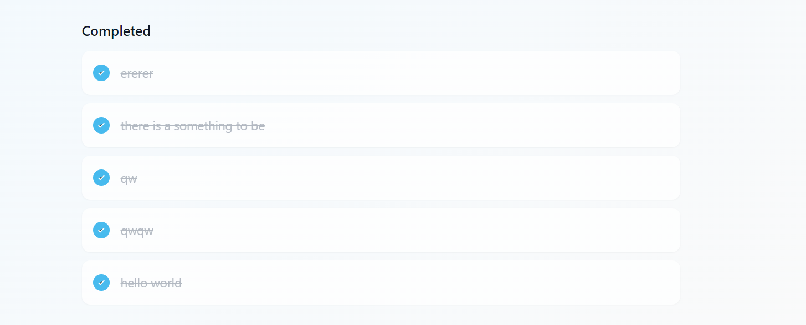

# Modern Task Manager App

A sleek and intuitive task management application built with **React**, **TypeScript**, and **Tailwind CSS**.

## Features

- Add, edit, and delete tasks
- Mark tasks as completed
- Categorize tasks
- Set priority levels
- Persistent storage using `localStorage`
- Real-time progress tracking
- Responsive design
- Modern UI with smooth animations

## Tech Stack

- **React.js 18+**
- **TypeScript 5+**
- **Tailwind CSS 3+**
- **Vite (Build tool)**

## Prerequisites

- **Node.js 16+**
- **npm** or **yarn**

## Project Setup

### Clone the repository:

```bash
git clone https://github.com/yourusername/task-manager.git
cd task-manager
```

### Install dependencies:

```bash
npm install
```

### Start the development server:

```bash
npm run dev
```

### Build for production:

```bash
npm run build
```

### Preview production build locally:

```bash
npm run preview
```

## Project Structure

```
src/
├── components/
│   ├── Header.tsx       # Displays app title and progress circle
│   ├── Layout.tsx       # Main layout wrapper with background styling
│   ├── TaskInput.tsx    # Form for adding new tasks
│   ├── TaskItem.tsx     # Individual task component with edit/delete functionality
│   └── TaskList.tsx     # Manages the list of tasks and their organization
├── types/
│   └── todo.ts          # Type definitions for tasks
├── App.tsx              # Main application component
└── main.tsx             # Entry point for the React app
```

## Available Scripts

- **`npm run dev`**: Start development server
- **`npm run build`**: Build for production
- **`npm run preview`**: Preview production build locally
- **`npm run lint`**: Run ESLint

## How to Use

### Add a New Task:

1. Click the `+` button or input field.
2. Enter task details.
3. Select category and priority.
4. Click **"Add Task"**.

### Edit a Task:

1. Click the **edit** icon on any task.
2. Modify the details.
3. Click **"Save Changes"**.

### Delete a Task:

1. Click the **delete** icon.
2. Confirm deletion in the popup.

### Complete a Task:

1. Click the **checkbox** next to the task.

## Screenshots




### Task Management Page


### Adding a New Task


### Editing a Task


## Live Demo

[**View Live Demo**](https://todo-react-nine-iota.vercel.app/)
[**ALTETR View Live Demo**](https://todo-react-bbxu.onrender.com/)

## Contributing

1. Fork the repository.
2. Create a new branch.
3. Make your changes.
4. Submit a pull request.

## License

This project is licensed under the [MIT License](LICENSE).

---

Thank you for checking out **Modern Task Manager App**! We hope it helps you stay organized and productive.
